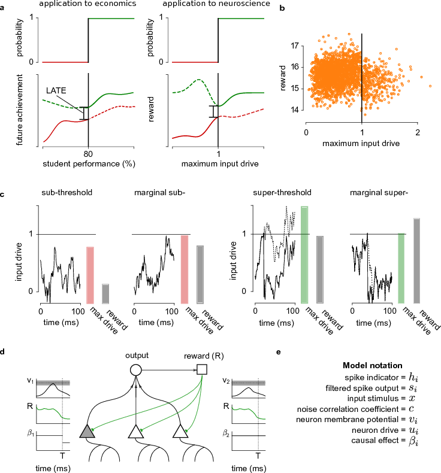

## Spiking networks as a regression discontinuity design

Learning aims at causing better performance, and the typical gradient descent learning is an approximate causal estimator. However real neurons spike, making their gradients undefined. Interestingly, a popular technique in economics, regression discontinuity design, estimates causal effects using such discontinuities. Here we show how the spiking threshold can reveal the influence of a neuron's activity on the performance, indicating a deep link between simple learning rules and economics-style causal inference.

`python` code and jupyter notebooks to reproduce figure from our biorxiv preprint ([here](https://www.biorxiv.org/content/early/2018/01/24/253351.article-info)).

See the text for more details.

